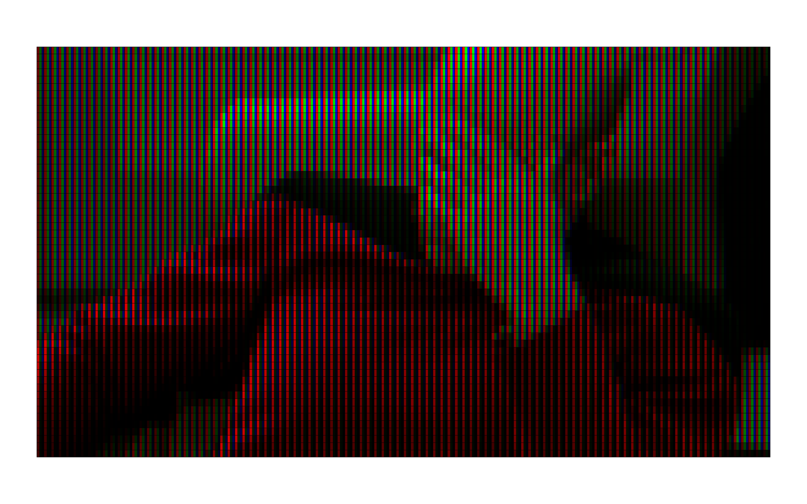
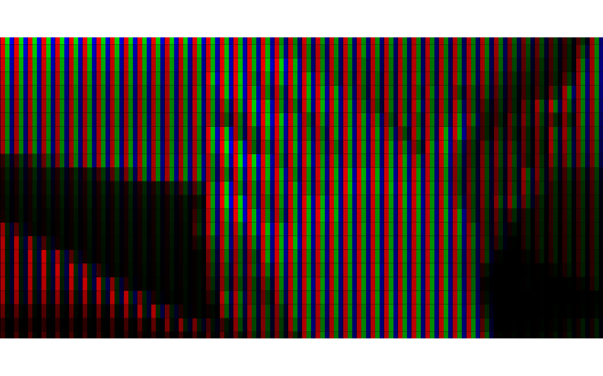

# CRT

A quick and dirty attempt at simulating the old CRT screens with
individual RGB colour elements.

``` r
#' Simulate a CRT display
#'
#' @param img File path or URL of image
#' @param x_res Desired horizontal resolution of image (default = 50)
#' @param brightness Modulate brightness (percentage of original image brightness, default = 110)
#' @param interpolate Should the image be interpolated, logical (default = FALSE)
crt <- function(img, x_res=50, brightness=110, interpolate = FALSE){

  if(class(img) == "magick-image"){
    i <-
      img %>%
      magick::image_scale(geometry = magick::geometry_size_pixels(width=x_res)) %>% 
      magick::image_modulate(brightness = brightness) %>% 
      magick::image_raster() %>% 
      tibble::as_tibble()
  } else {
    i <-
      magick::image_read(img) %>%
      magick::image_scale(geometry = magick::geometry_size_pixels(width=x_res)) %>% 
      magick::image_modulate(brightness = brightness) %>% 
      magick::image_raster() %>% 
      tibble::as_tibble()
  }
  
  # Convert pixel colour to individual rgb values and append back to dataframe
  i_df <-
    i %>% 
    dplyr::bind_cols(col2rgb(i$col) %>% t() %>% tibble::as_tibble()) %>% 
    tidyr::pivot_longer(c(red, green, blue)) %>% 
    dplyr::mutate(value = scales::rescale(value, to=c(1, 256)))
  
  # Extract dimensions  
  mx <- max(i$x)
  my <- max(i$y)
  
  # A few look up values (should be made outside of function)
  # RGB spacing
  s <- 1/3/2
  sp <- c(s, 3*s, 5*s)
  
  # RGB colour palettes
  rp <- colorRampPalette(c("black", "red"))(256)
  gp <- colorRampPalette(c("black", "green"))(256)
  bp <- colorRampPalette(c("black", "blue"))(256)
  
  # Plot
  i_df %>% 
    dplyr::mutate(new_x = purrr::map(i$x, ~.x+sp) %>% unlist(),
                  col = dplyr::case_when(name == "red" ~ rp[value],
                                         name == "green" ~ gp[value],
                                         name == "blue" ~ bp[value])) %>% 
    ggplot2::ggplot()+
    ggplot2::geom_raster(ggplot2::aes(x=new_x, y=y, fill=col), interpolate = interpolate)+
    ggplot2::geom_segment(data = tibble::tibble(x = seq(1, mx+1, by=1), 
                                                y = 0.5,
                                                xend = seq(1, mx+1, by=1),
                                                yend = my+0.5),
                          ggplot2::aes(x=x, xend=xend, y=y, yend=yend),
                          size = 0.0)+
    ggplot2::geom_segment(data = tibble::tibble(x = 1, 
                                                y = seq(0.5, my+0.5, by=1),
                                                xend = mx+1,
                                                yend = seq(0.5, my+0.5, by=1)),
                          ggplot2::aes(x=x, xend=xend, y=y, yend=yend),
                          size = 0.0)+
    ggplot2::scale_y_reverse()+
    ggplot2::coord_equal()+
    ggplot2::scale_fill_identity()+
    ggplot2::theme_void()
}
```

``` r
library(tidyverse)
```

``` r
crt('picard-facepalm.jpg', x_res = 100)
```

<!-- -->

``` r
last_plot() + coord_equal(xlim=c(40,80), ylim=c(30, 10))
```

    ## Coordinate system already present. Adding new coordinate system, which will replace the existing one.

<!-- -->
